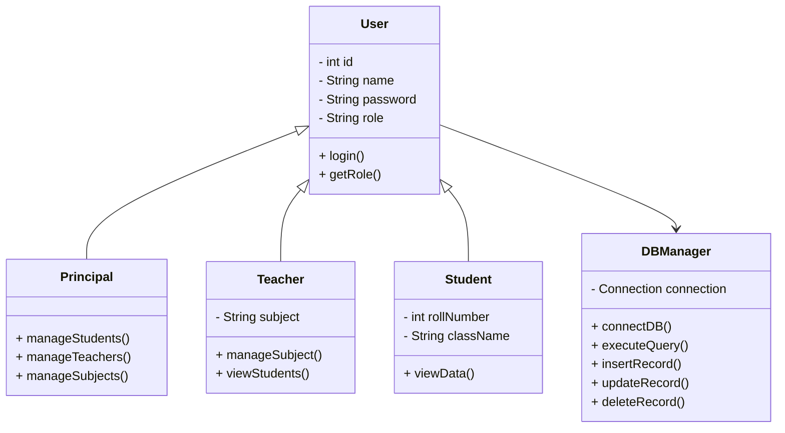

# UML Class Diagram – School Management System

```mermaid
classDiagram
class User {
    - int id
    - String name
    - String password
    - String role
    + login()
    + getRole()
}
class Principal {
    + manageStudents()
    + manageTeachers()
    + manageSubjects()
}
class Teacher {
    - String subject
    + manageSubject()
    + viewStudents()
}
class Student {
    - int rollNumber
    - String className
    + viewData()
}
class DBManager {
    - Connection connection
    + connectDB()
    + executeQuery()
    + insertRecord()
    + updateRecord()
    + deleteRecord()
}
User <|-- Principal
User <|-- Teacher
User <|-- Student
User --> DBManager
```